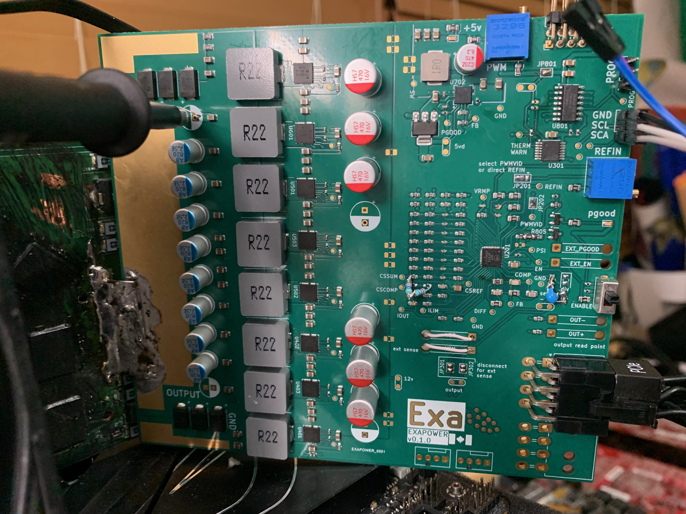

# rev 0.1

first prototypes, 5 pcbs, 2 assembled\
8x sic620a\
ncp81274\
mostly 0805/0603 with only a little bit of 0402\
126x140mm

There is a small error in the current loop where I connected to csref instead of cssum. Fixed with turning a mlcc 90 degrees and replacing the 165k smd resistor with a through hole resistor. Additionally the pullup resistor for the main pgood signal was missing a pullup (fixed with 390 ohm resistor inbetween two other 0805s), 100k used as pullup for therm_warn caused shutdowns under non light loads (fixed with 10k pullup stollen from gtx 570), and the differential sense voltage lines in the pcb don't work properly and required 330pF added across. The 6/8 pin footprints also have the wrong pitch so the pins need to be bent slightly to get them in the holes. A 47nF 0402 mlcc was added in parallel to the existing mlcc for the pwmvid low pass filter to allow for lower frequency (just above 100khz instead of over 400khz). The lower frequency allows more clock granularity. Additionally, the resistors for the pwm vid interface were changed such that the default boot voltage was higher but the total voltage range was shrunk to further improve clock granulatiry. This change requires the firmware to be outputing pwm before the vrm gets to far through soft start in order for the boot voltage to not be to high. The resistors for phth and psi were also changed to allow for phase shedding at light load. 

The solder jumpers have to be properly configured to switch between the microcontroller (attiny404) controlling the voltage with pwmvid or the other potentiometer directly controlling refin. 

The div resistor can be 200 ohm for +20% (2.2v max, 1.1v min) (tested working) or 133 ohm for +30% (2.4v max, 1.2v min) (unstested).

