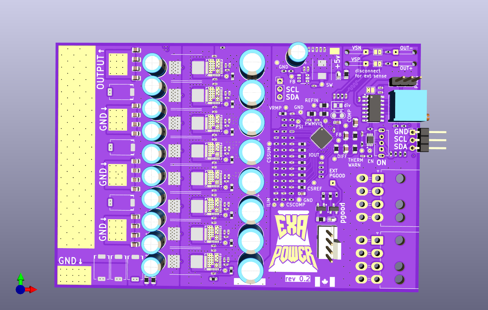

# rev 0.2
second prototype, 10 pcbs, 5 assembled\
8x sic620a\
ncp81274\
mostly 0402\
118x80mm

Something seems flawed with the current sensing, massive oscillations on cspx causing per phase ocp to trigger extemely low even when set to max possible. Since it can't even run a 9600 gt its not very useful. Rev 0.3 is only a few small changes but works better.

Similar div resistor option as in rev 0.1