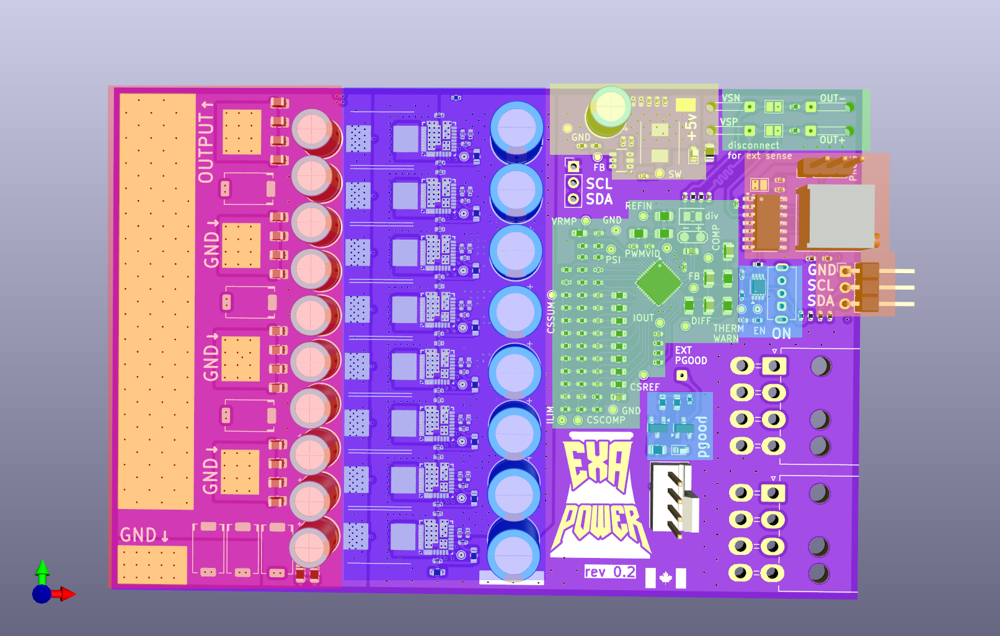
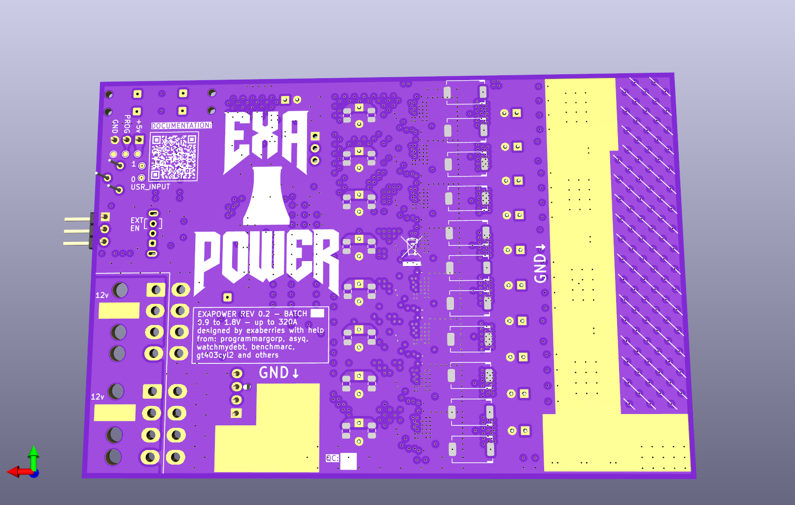
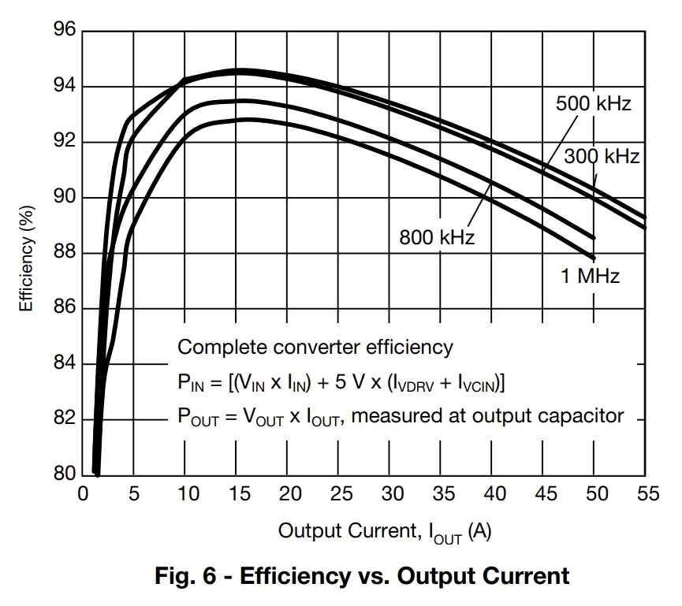
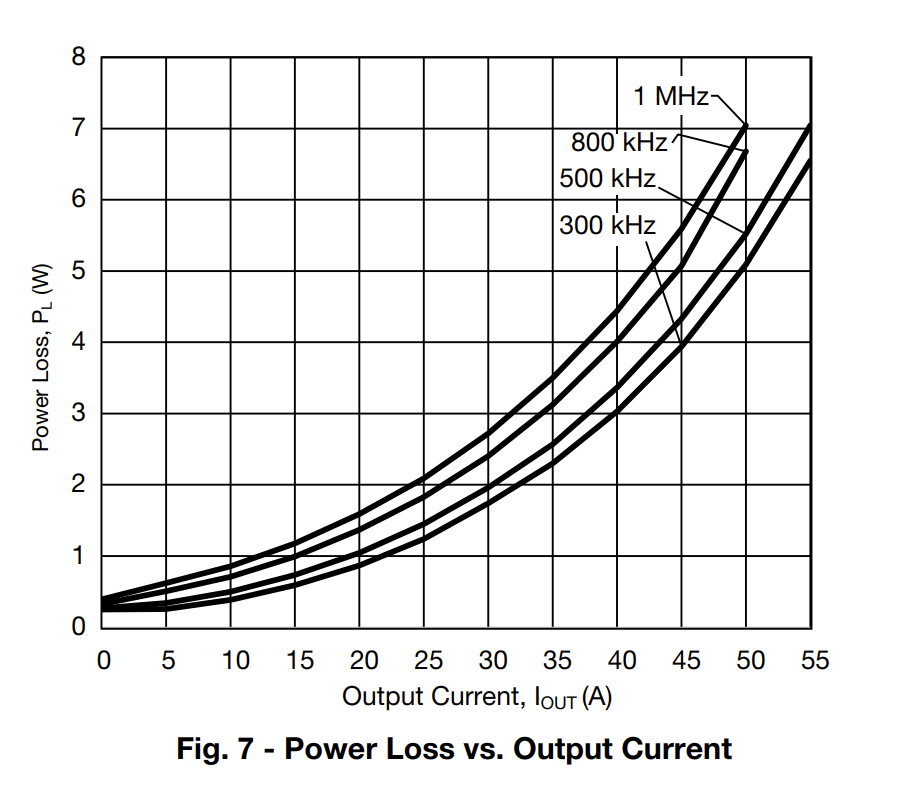
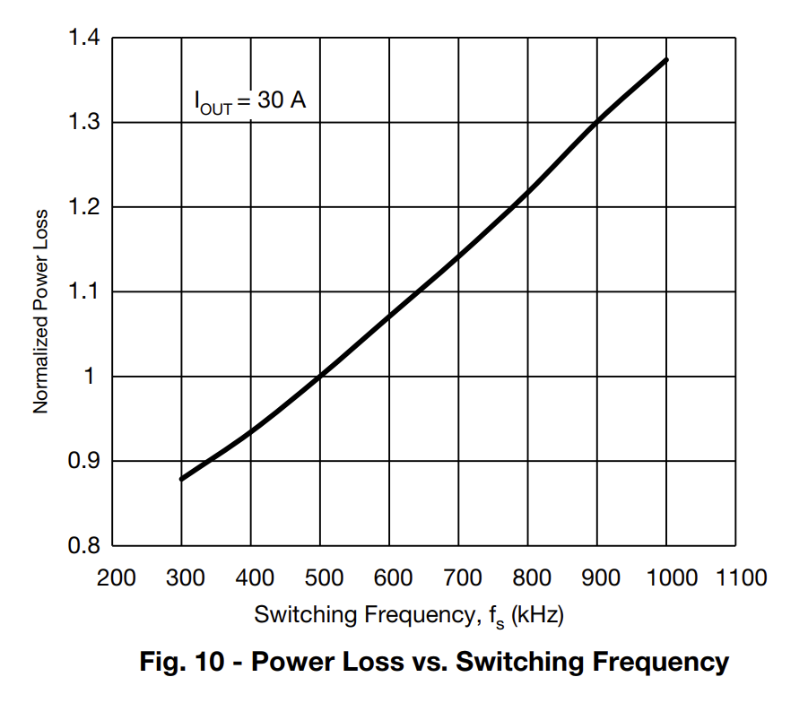
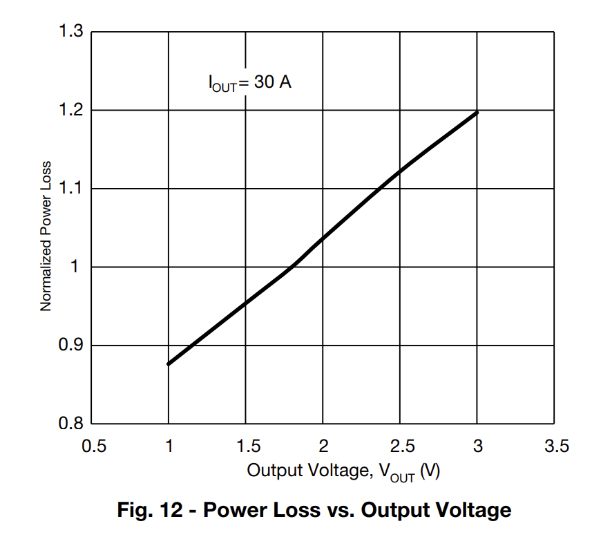
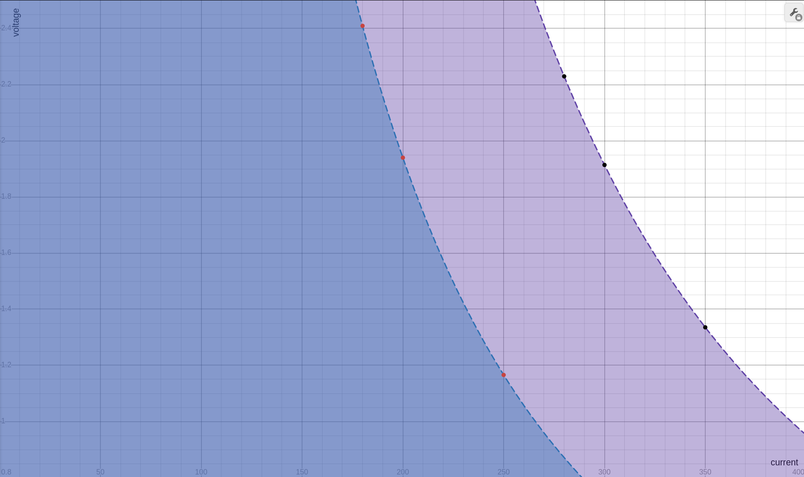

# rev 0.2
second prototype, 10 pcbs, 5 assembled\
8x sic620a\
ncp81274\
mostly 0402\
118x80mm

## quick tour

A quick overview of the pcb, more details on each section can be found further below. 

#### starting with the front

The pcb can be split up into 5 main areas:
1: output connection areas and output filtering (red)
2: phases and input filtering (dark blue)
3: pwm controller (green)
4: micro (orange)
5: en/pgood signals (light blue)

Additionally, there is the 2 6/8 pins and the fan header towards the bottom right.

###### pwm controller
The ncp81274 is a 8 phase controller from onsemi. We can further divide this section into the current measurement and ocp, compensation loop, sense, and pwmvid.

###### micro
An attiny404 provides the pwmvid signal and monitors the vrm to watch for faults. The controller also helps control the enable signal to the controller. The prog header is used to program the micro using UPDI. A high voltage programmer isn't necessary since the pin is execlusively used for UPDI. The i2c header connects to both the micro and the pwm controller. Most of the time the micro will present as a i2c slave but ocassionally it will act as a i2c master to configure the pwm controller if desired. The trimpot provides the user input to the controller, by default it is used to set the output voltage but depending on firmware can be repurposed however desired. 

#### the back

The capacitors on the back are unpopulated because they would only marginally help improve the output regulation and the time would be better spent adding more capacitors on the actual pcb you are connecting to since the high impedance of your connection makes capacitors on the exapower pcb pretty much useless. The pads are provided if you do want to spend the time and money if you so desire (you can blame sask for the request). The 0805 pads are for input filtering mlccs and the pads for smd polymers are for the output filter.

The large exposed copper/enic areas are ground except for those at the very back by the power input which are exposed 12v.

Also on the back there are solder pads for additional user input to the micro, keep in mind these pads are fairly fragile. There are also pads for each part of the prog header. A bit further down there is the marking for which pad you can add to if you want an external enable signal. To the right of the 'exa' text in the exapower logo is the header for i2c daisy chaining. 

## quick start guide

#### 5v pad for the vcore vrm

By default the pad is not shorted so that when trying to power the pcb from the prog header you only connect to the micro and not everything else that is powered by 5V. The card can be powered by the internal 5v vrm while programming and even supply 5v power back to the programmer if necessary. It isn't a good idea to try to feed 5v into the prog pin while the internal 5v vrm is on without unshorting the pad first, consider it *undefined* behavior (of the magic smoke potential kind).

For normal operation leave the pad shorted and ignore it.

#### internal sense pads

Right next to the vsp/vsn there are pads to select between external sense lines and internal sense traces. The vrm is primarily designed for use with the external sense but internal traces are provided, especially to make it easier to test the vrm quickly. When connecting external sense use twisted pair and ensure that the lines stay away from the phases if possible to reduce any emi from the switch nodes. If the imepdance from the vrm output to the sense point is too high that may also affect vrm operation but it is hard to judge without testing specific circumstances. In general you want to at least connect to the actual pcb you are connecting the exapower too so that it can regulate voltage at that point. If you just use the internal traces the vrm regulation will optimize for the connection points and you will get a large voltage drop (especially at higher frequency) to the actual silicon. Well placed external sense cannot completely compensate for it but it will help.
> [!CAUTION]
> !!! do not turn try to turn on the vrm without it being able to sense the output voltage either through the internal traces or external wires to vsp/vsn !!!>
> I probably don't have to say why the controller can't regulate itself properly if it can't sense output voltage.... 

Once you have it properly configured you should be able to plug in the exapower to 12v and it will startup the 5v vrm automatically, the LED right next to the 5v vrm should be on. If you are not using the ext sense then that position on the switch will act as 'off' for the en signal to the pwm controller. Make sure the switch in down towards the 'ON' text on the silkscreen for the output voltage to start. If everything is correct you should see the LED down by the fan header on, that indicates that the controller has pgood.

The next step is to adjust the output voltage to what you want to test whatever you are attaching it too. Then its the normal process of connecting any powercard to a pcb, nice strong lower impedance connections with high current capacity. 

## specs
8 phase of sic620a power stages\
ncp81274 controller\
ocp ~400A\
2x 6 or 8 pin pcie power connectors\
5v single phase vrm up to 2A\
6 layer pcb\
up to 1.8v without a dividing resistor, and up to 2.2v with\
400khz switching frequency

### safe operating area
The safe operating area of output voltage and current is complex. Primarily the limit is thermal, while the sic620a has an electrical limit of 60A and the inductors similarily can support 60A, the power loss would be unsupportable. As such total ocp is set around 400A, 50A per phase. The power loss / efficiency of the vrm is primarily related to the current although higher voltage increases the power loss and as such lowers the max coolable current output. Furthermore, the vias and power / ground planes are not well sized for average current output near the ocp limit. 

The following are graphs relating to the power loss for the sic620a.

The most important is fig 7. With a switching frequency of 400 khz, that places the power loss between the 300 khz and 500 khz slopes. The following is some estimates based on it.

| Output Current (A) | Power loss (W) |
| ------------------ | ---------- |
| 10                 | 0.35       |
| 20                 | 0.95       |
| 30                 | 1.90       |
| 35                 | 2.40       |
| 40                 | 3.20       |
| 45                 | 4.10       |
| 50                 | 5.20       |

This power loss is for a single phase at lower voltage output not including the power loss in the inductor. The power loss from other components on the pcb is mostly inconsiquential aside from the power loss within the pcb itself. For cooling the vrm we have to ensure that individual power stages are not getting to hot due to the thermal resistance and that the pcb temperature does not rise too high due to the total power loss. The sic620a is also quoted as having a thermal resistance junction to case of 1.6 C / W and junction to ambient of 10.6 C / W. 

At 50A the 5.2W of power loss would be getting hard to cool even with good airflow with an overall power loss in the power stages alone of 41.6W, and another 10W or so expected in the inductors. This informs the 400A total ocp limit since it is the limit where the vrm can be comfortably cooled without too much work with good margin. Furthermore, while the case of the sic620a can be fairly hot and still stay under the max junction temperature, there would be negative effects for the lifespan of the pcb and other components such as capacitors nearby. Therefore, it is recommended to keep the overall pcb temp under 80c. All together with minimal to no airflow the functional limit would be somewhere around 30-40A per phase, 240A to 280A overall. And 320A - 360A with airflow from a normal fan. With higher rpm fans higher current is possible and we are overclockers afterall, throwing more cooling to push something to its limit isn't foreign territory.

Due to cost constraints with low volume and limited space for mounting holes, the design does not include a heatsink. A heatsink would also have to add enough surface area to justify its increased thermal resistance. 

Addtionally, the two 6 pins to supply 12v to the board and the power plane may need airflow to support high power draw, 300A at 1.6V is 480W of output, to account for power loss by the vrm in total lets add another 10% (it likely would be even more), then we end up with 528W of power input to the pcb. With each 6 pin being 3 pairs of 12v and ground we get 44A at 12v devided by 6 pairs. Which leads to 7.3A per pair. While within the 9A per pin of a mini fit jr there is not too much margin left. Especially if we consider that the 12v rail may droop a bit and with less voltage but the same power output the current will further increase. Therefore there is a practical max limit of ~550-600W of power input to the pcb. Furthermore, there is a single 1 oz copper layer to carry the 12v current. High airflow can extend this further but as noted in the section below there are other limits to consider. 

##### An important note about output voltage
At higher output voltages, there is increased power loss which derates the listed output current above. As in figure 12 above, going from 1V out to 2V output, increases the power loss from ~0.95% normalized power loss to 114% normalized power loss. The following graph is an estimate overall of derating the current output with rising output voltage. Fortunately most silicon that benefits from very high output voltages (>2v) does not draw high enough current for this to be a significant concern. The blue area represents what can be easily cooled with limited to no airflow and the purple area is what can be easily cooled with a fairly normal computer fan.

Here are some values from the table of the more conservative estimate (low to no airflow, ~16W of power loss) to make it a bit easier:
| Output Current (A) | Voltage (V) |
| ------------------ | ----------- |
| 180                | 2.41        |
| 200                | 1.94        |
| 250                | 1.17        |

And with the more airflow scenario (~32W of power loss):
| Output Current (A) | Voltage (V) |
| ------------------ | ----------- |
| 280                | 2.23        |
| 300                | 1.91        |
| 350                | 1.34        |

You can see that even with decent airflow, that going from 1.34V to 1.91V drops the current we can pull from 350A to 300A. This is just an approximation so take it as guidelines.

A link to the safe operating area graph in desmos: https://www.desmos.com/calculator/tuswjwh2sj

## micro in depth

## firmware

